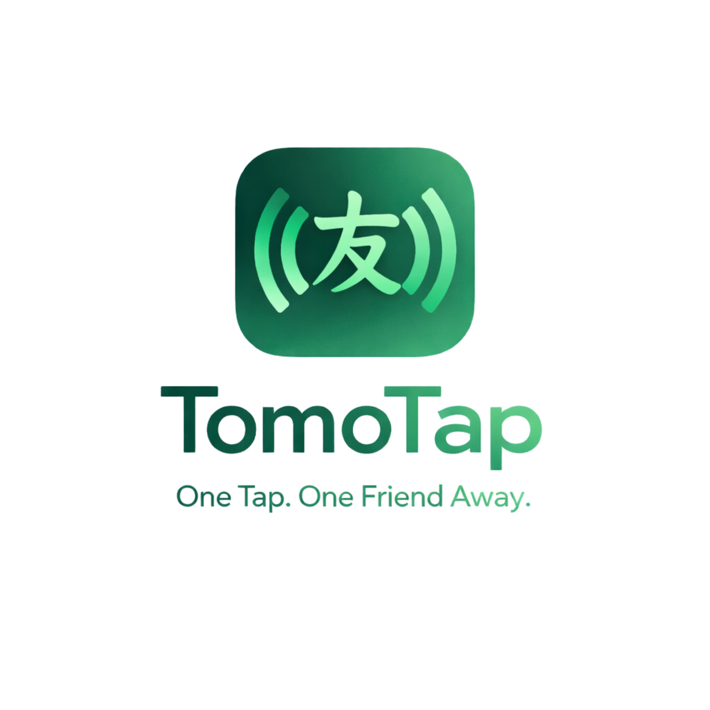

<div align="center">



```
  _____ ___  __  __  ___ _____  _   ___
 |_   _/ _ \|  \/  |/ _ \_   _|/ \ | _ \
   | || (_) | |\/| | (_) || | / _ \|  _/
   |_| \___/|_|  |_|\___/ |_|/_/ \_\_|
```

# TOMOTAP — Smart Identity via Tap

**A production-ready Python + Arduino NFC tag writer & reader CLI.**
Write URLs, contacts, social links, WiFi credentials, and more to NFC cards that any smartphone can read instantly.

**Now supports using your Android phone as the NFC reader — no Arduino required!**

[](https://www.python.org/downloads/)
[](LICENSE)

</div>

---

## What is TOMOTAP?

TOMOTAP is a lightweight **CLI clone of NFC Tools** that communicates with an Arduino-connected PN532 NFC module to write **NDEF-formatted data** onto NTAG213/215/216 cards. When tapped with a smartphone, the cards trigger actions like opening URLs, saving contacts, connecting to WiFi, and more — **no app required**.

## Features

| Feature | Description |
|---------|-------------|
| **URL Writer** | Write any website link |
| **vCard Writer** | Full contact cards with name, phone, email, org |
| **Phone / Email** | Tap to call or compose email |
| **Social Media** | Auto-resolves 17+ platforms from username |
| **WiFi Writer** | Tap to connect (Android 5+) |
| **Custom Text** | Write any plain text message |
| **Tag Format** | Write empty NDEF container (prepare tag) |
| **Tag Lock** | Permanent read-only protection |
| **Tag Erase** | Clean wipe to factory state |
| **Tag Reader** | Read and parse NDEF contents |
| **Bulk Mode** | Write same data to hundreds of cards |
| **Write History** | SQLite-powered logging with stats |
| **Duplicate Detection** | Warns before overwriting |
| **Auto Port Detection** | Finds your Arduino automatically |
| **📱 Phone NFC Mode** | Use your Android phone as the NFC reader via USB |

## Quick Start — One-Command Install

Get TOMOTAP running with a single command. Installs Python, ADB, git, all dependencies, and launches TOMOTAP.

**Linux / macOS:**
```bash
curl -sSL https://raw.githubusercontent.com/CharlesNaig/TOMOTAP/main/setup.sh | bash
```

**Windows (PowerShell):**
```powershell
irm https://raw.githubusercontent.com/CharlesNaig/TOMOTAP/main/setup.ps1 | iex
```

> The scripts will auto-install Python 3, pip, git, and ADB platform-tools if missing, then clone the repo and install all Python dependencies.

---

## Manual Setup — Two Reader Options

### Option A: Phone NFC Mode (No Arduino Needed!)

Use your Android phone's built-in NFC chip instead of Arduino + PN532/RC522.

#### Requirements

| Component | Details |
|-----------|---------|
| **Android Phone** | Any phone with NFC (e.g., Poco M5s, Samsung Galaxy, Pixel) |
| **USB Cable** | To connect phone to PC |
| **ADB** | Android SDK Platform Tools ([download](https://developer.android.com/tools/releases/platform-tools)) |
| **Google Chrome** | On your phone (Web NFC requires Chrome on Android) |
| **NFC Cards** | NTAG213 / 215 / 216 |

#### Setup Steps

1. **Install ADB** — Download [Platform Tools](https://developer.android.com/tools/releases/platform-tools), extract, add to PATH

2. **Enable USB Debugging** on your phone:
   - Go to **Settings → About Phone** → tap **Build Number** 7 times
   - Go to **Settings → Developer Options** → enable **USB Debugging**

3. **Connect phone via USB** — accept the "Allow USB debugging?" prompt on your phone

4. **Verify ADB** connection:
   ```bash
   adb devices
   # Should show your phone's serial number
   ```

5. **Set reader mode to phone:**
   ```json
   // config.json
   {
     "reader_mode": "phone",
     ...
   }
   ```
   Or change it in TOMOTAP Settings (option 14).

6. **Install Python dependencies:**
   ```bash
   pip install -r requirements.txt
   ```

7. **Run TOMOTAP:**
   ```bash
   python -m techtap
   ```
   TOMOTAP will:
   - Set up ADB reverse port forwarding
   - Start WebSocket + HTTP servers
   - Open Chrome on your phone with the NFC bridge page
   - Wait for your phone to connect

8. **On your phone:** tap **"Enable NFC Scanner"** button in Chrome

9. **Back on PC:** use TOMOTAP CLI normally — write URLs, contacts, read tags, etc.

> **How it works:** Python CLI → WebSocket → Chrome on phone → Web NFC API → NFC Tag. All communication goes over USB via ADB reverse port forwarding. No internet needed.

### Option B: Arduino Mode (Original)

#### 1. Hardware Requirements

| Component | Recommended | Notes |
|-----------|------------|-------|
| **NFC Module** | PN532 | Best phone compatibility |
| **Arduino** | Uno / Nano / Mega | Any with USB serial |
| **NFC Cards** | NTAG213 / 215 / 216 | **NOT** Mifare Classic |

> **Important:** Use NTAG cards, not generic UID cards. Phones read NDEF, not raw memory.

### 2. Wiring (PN532 → Arduino Uno, I2C)

| PN532 Pin | Arduino Pin |
|-----------|-------------|
| SDA | A4 |
| SCL | A5 |
| VCC | 5V |
| GND | GND |
| IRQ | D2 (optional) |
| RST | D3 (optional) |

### 3. Flash Arduino Firmware

1. Open `techtap/arduino/techtap_reader.ino` in Arduino IDE
2. Install library: **Adafruit PN532** (via Library Manager)
3. Select your board and port
4. Upload

### 4. Install Python App

```bash
# Clone the repository
git clone https://github.com/CharlesNaig/TOMOTAP.git
cd TOMOTAP

# Install dependencies
pip install -r requirements.txt

# Or install as a package
pip install -e .
```

### 5. Run TOMOTAP

```bash
# Option A: Module
python -m techtap

# Option B: Direct script
python techtap/cli.py

# Option C: If installed as package
techtap
```

## Usage

```
╭────────────────────────────────╮
│       TOMOTAP CLI              │
├──────┬─────────────────────────┤
│ [1]  │ Write Website URL       │
│ [2]  │ Write Contact (vCard)   │
│ [3]  │ Write Phone Number      │
│ [4]  │ Write Email Address     │
│ [5]  │ Write Social Media      │
│ [6]  │ Write Custom Text       │
│ [7]  │ Write WiFi Credentials  │
│ [8]  │ Format Tag (NDEF)       │
│ [9]  │ Erase Tag               │
│ [10] │ Lock Tag                │
│ [11] │ Read Tag                │
│ [12] │ Tag Info                │
│ [13] │ Bulk Write Mode         │
│ [14] │ Write History           │
│ [15] │ Settings                │
│ [0]  │ Exit                    │
╰──────┴─────────────────────────╯
```

### Example: Write a URL

```
Select option: 1

── Write Website URL ──

Enter URL [https://]: https://tomotap.dev

╭─ Data Preview ────────────────────╮
│ Type:  URL                        │
│ Size:  22 bytes                   │
│ Data:  https://tomotap.dev        │
│  ✓ NTAG213: 15.3% (122 free)     │
│  ✓ NTAG215: 4.4% (482 free)      │
│  ✓ NTAG216: 2.5% (866 free)      │
╰───────────────────────────────────╯

Proceed with write? [Y/n]: y

📱 TAP YOUR NFC CARD NOW...

✓ SUCCESS: Written to tag A3FF2219 (1 attempt(s)) ✓ Verified
```

### Supported Social Platforms

Discord, Facebook, GitHub, Instagram, LinkedIn, Pinterest, Reddit, Snapchat, Spotify, Telegram, Threads, TikTok, Twitch, Twitter/X, WhatsApp, YouTube

```
Platform: instagram
Username: charles.dev
→ https://instagram.com/charles.dev
```

## Serial Protocol

Communication between Python and Arduino uses a simple text protocol at 115200 baud:

```
Direction    Format                  Example
─────────    ──────                  ───────
PC → Arduino COMMAND|DATA\n          WRITE_RAW|0301..FE\n
Arduino → PC RESPONSE|DATA\n        TAP_CARD\n
Arduino → PC RESPONSE|DATA\n        VERIFY_OK|A3FF2219\n
```

| Command | Params | Response Flow |
|---------|--------|---------------|
| `PING` | — | `PONG` |
| `WRITE_RAW` | hex NDEF | `TAP_CARD` → `VERIFY_OK\|uid` |
| `ERASE` | — | `TAP_CARD` → `ERASE_OK\|uid` |
| `READ` | — | `TAP_CARD` → `DATA\|hex` |
| `LOCK` | — | `TAP_CARD` → `LOCK_OK\|uid` |
| `INFO` | — | `TAP_CARD` → `TAG_INFO\|uid:...,type:...,size:...,locked:...` |

## Project Structure

```
TOMOTAP/
├── techtap/
│   ├── __init__.py          # Package init
│   ├── __main__.py          # python -m techtap entry
│   ├── cli.py               # Interactive CLI application
│   ├── rfid_reader.py       # Serial communication handler
│   ├── phone_nfc.py         # Phone NFC bridge (WebSocket + ADB)
│   ├── ndef_encoder.py      # NDEF binary encoder
│   ├── database.py          # SQLite tag logging
│   ├── utils.py             # Helpers, config, validation
│   ├── static/
│   │   └── phone_nfc.html   # Phone NFC web UI (Chrome)
│   └── arduino/
│       └── techtap_reader.ino  # Arduino firmware
├── setup.sh                 # One-command setup (Linux/macOS)
├── setup.ps1                # One-command setup (Windows)
├── config.json              # User configuration
├── pyproject.toml           # Python packaging
├── requirements.txt         # Dependencies
└── README.md                # This file
```

## Configuration

Edit `config.json`:

```json
{
  "serial": {
    "port": "auto",
    "baudrate": 115200,
    "timeout": 5
  },
  "module": "PN532",
  "verify_after_write": true,
  "max_retries": 3,
  "log_writes": true
}
```

Set `"port": "COM3"` (Windows) or `"port": "/dev/ttyUSB0"` (Linux) to lock to a specific port. Use `"auto"` for auto-detection.

## NTAG Card Capacity

| Card | User Memory | Best For |
|------|-------------|----------|
| NTAG213 | 144 bytes | Single URL, phone, short text |
| NTAG215 | 504 bytes | vCard, social links, WiFi |
| NTAG216 | 888 bytes | Full contact + multiple records |

## Troubleshooting

| Issue | Fix |
|-------|-----|
| "No Arduino detected" | Check USB cable, install CH340/CP2102 drivers |
| "PN532 not found" | Check I2C wiring (SDA/SCL), ensure 5V power |
| Phone doesn't read card | Use NTAG cards (not Mifare Classic), test Android first |
| "Data too large" | Use NTAG215/216 for vCards and WiFi |
| Write fails | Hold card still during write, don't remove early |
| iPhone won't read | Ensure NDEF is properly formatted, iOS is stricter |

## Business Idea: TOMOTAP Smart Cards

| Tier | Price | Features |
|------|-------|----------|
| Basic | ₱50 | Single link |
| Pro | ₱99 | Contact + social links |
| Elite | ₱149 | Editable + rewrite support |

Perfect for students, networking events, and small businesses.

## Roadmap

- [ ] GUI version (Textual / PyQt)
- [ ] Phone writer companion app
- [ ] Admin dashboard
- [ ] Tap analytics (scan tracking via redirect)
- [ ] Multi-record NDEF support
- [ ] Custom card design ordering

## License

MIT License — free to use, modify, and sell.

---

<div align="center">

**Built with purpose. Tap into the future.**

**TOMOTAP** © 2026

</div>
